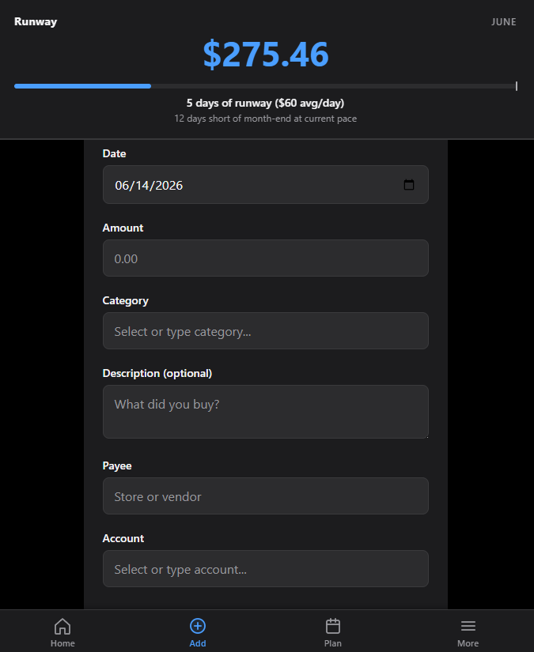

# Finance

A self-hosted personal finance tracker I built to replace a Google Sheet I'd been maintaining for years. It runs on my home server as a four-container Docker stack and lives on my phone's home screen as an installed PWA.

The goal was a system where entering a transaction takes one tap, the math behind "how much can I still spend this month" is verifiable instead of being a fragile spreadsheet formula, and the data lives somewhere I can query directly.

> Built by **Thomas Morgan** — currently looking for data engineering and systems analyst roles.



---

## What it does

- **Track spending power** — a single number representing "money still available this month" that automatically reflects every new transaction, computed by a Postgres view
- **One-tap transaction entry** — pick a type, enter the amount, fill in category/payee, submit
- **Recurring transactions** — bills, subscriptions, savings contributions, and income, with optional installment-plan support for splitting one-time purchases
- **Runway visualizer** — a bar indicator showing average daily spending and projected runway
- **Mobile-first** — installed as an iOS PWA, works offline-from-cellular at home, swipe-to-edit/delete

## Stack

| Layer | Tech |
|-------|------|
| Database | PostgreSQL 16 |
| API | Node.js + Express |
| Frontend | Vanilla HTML/CSS/JS (no framework, no build step) |
| Visualization | Metabase (dashboards), pgAdmin (admin/queries) |
| Orchestration | Docker Compose, managed via [Komodo](https://komo.do/) |
| Hosting | Self-hosted on a home Linux server |

No build pipeline. No npm scripts. No transpilation. The browser receives what's on disk.

---

## Architecture

Four containers, one network, one Postgres volume:

```
                    ┌──────────────────────────────────┐
                    │      finance_default network     │
                    │                                  │
   Phone/laptop ────┼──→ finance-mobile-api  (3002)    │
                    │         (Node/Express)           │
                    │              │                   │
   Browser ─────────┼──→ finance-metabase    (3001)    │
                    │              │                   │
   Browser ─────────┼──→ finance-pgadmin     (8082)    │
                    │              │                   │
                    │              ▼                   │
                    │      finance-postgres  (5432)    │
                    │              │                   │
                    │              ▼                   │
                    │   finance_postgres_data (volume) │
                    └──────────────────────────────────┘
```

Each container has a focused job:

- **`finance-postgres`** — single source of truth. All data lives here.
- **`finance-mobile-api`** — thin HTTP layer over the database. ~12 endpoints, no ORM, parameterized SQL.
- **`finance-metabase`** — dashboards, charts, "how did spending compare to last month" reports.
- **`finance-pgadmin`** — admin UI for ad-hoc queries and quick edits.

Inter-container DNS is handled by Docker's service-name resolution (`postgres:5432` from any sibling container). The Postgres volume is marked `external: true` so a `docker compose down` can never accidentally delete years of data.

The whole stack is defined in a single `docker-compose.yml` and deployed via Komodo's web UI. Environment variables (DB credentials, optional links to surface in the UI) are sourced from `.env`, which is gitignored.

---

## The interesting bits

### A view that does real work

Spending power could have been a stored value updated by triggers. Instead it's a Postgres view that recomputes from primary data on every read:

```sql
SELECT
  baseline + income - planned - spending AS spending_power
FROM budget_config bc
CROSS JOIN (SELECT SUM(amount) AS total FROM transactions
            WHERE month = date_trunc('month', NOW())::date AND type = 'Income') income
CROSS JOIN (SELECT SUM(amount) AS total FROM recurring_transactions
            WHERE is_active = true AND type <> 'Spending'
              AND start_date < (date_trunc('month', NOW()) + interval '1 month')::date
              AND (end_date IS NULL OR end_date >= date_trunc('month', NOW())::date)) planned
CROSS JOIN (SELECT SUM(amount) AS total FROM transactions
            WHERE month = date_trunc('month', NOW())::date AND type = 'Spending') spending;
```

(Simplified; full version in [`migrations/`](migrations/).)

This means there's no caching to invalidate, no triggers to debug, and no possibility of the displayed number drifting from the underlying data. Adding a new transaction immediately changes spending power. Editing one corrects it. Deleting one undoes it. The number is always derived, never stored.

### Linking ad-hoc to planned, transparently

Recurring transactions are *projected* into spending power before they happen — when you create a $200/mo recurring bill, spending power drops by $200 immediately, not when the actual transaction lands. That works cleanly for committed obligations.

But manually-logged transactions break the model. If I log a $300 ad-hoc savings transfer mid-month, the money leaves my checking account, but the planned-obligations subquery doesn't know about it, so spending power overstates what I have left. Earlier versions papered over this by having me manually lower the baseline.

The fix was a nullable `recurring_id` foreign key on `transactions`, pointing back at the source template for auto-generated rows. The `spending_power` view gained a small additional subquery: subtract any Bills or Savings transaction this month where `recurring_id IS NULL` — ad-hoc obligations that weren't projected via the planned subquery. Recurring-linked transactions stay excluded, since they're already in `planned`.

The total fix is two columns of new SQL and one new join in the view, but it eliminated a whole class of "why is my spending power wrong" friction.

### 5 days of runway remaining!

The spending power number alone tells you "how much" but not "are you on track?" A small aesthetically-fitting bar in the header solves this: a bar that projects how many days your current spending habits can last - your runway. This area reports to the user their current average spending per day, how many days this average can sustain them for, and how many days short of month-end at their current pace.

The math is intentionally simple — no exponential weighting, no historical comparisons — because the goal is "glance and know," not "predict the future."

### Idempotent, side-effect-free recurring transactions

Recurring entries are templates, not events. A monthly job creates a `transactions` row on the 1st for every active recurring entry. The recurring entry itself is never modified by the job. This means:

- Editing a recurring entry mid-month doesn't retroactively change past months
- Deleting a recurring entry doesn't delete historical transactions it generated
- "Pay first installment today" creates a real transaction now without coupling the recurring entry to it

For installment plans (a one-time purchase paid over N months), the form computes the per-payment amount and end date; the result is a normal recurring entry that naturally stops appearing in spending power once `end_date` passes.

### iOS PWA, no native rewrite

The app is installable on iOS via Safari → Add to Home Screen. With a `manifest.json`, a few `apple-mobile-web-app-*` meta tags, properly-sized icons, and `env(safe-area-inset-*)` CSS for the Dynamic Island/notch, it launches full-screen with no browser chrome and feels native. No App Store, no Apple Developer account, no Capacitor wrapper. The same code serves the desktop browser.

---

## Skills demonstrated

**Infrastructure / DevOps**
- Multi-container Docker Compose with a shared bridge network
- External named volumes to survive teardown
- Service-name DNS for inter-container communication
- Komodo-based deployment with environment-injected secrets
- Reverse-proxy-friendly layout (port mapping, no host networking)
- iOS PWA configuration (manifest, safe areas, splash, standalone display)

**SQL / data**
- A `spending_power` view using `CROSS JOIN`, `COALESCE`, `date_trunc`, timezone-aware timestamps, and conditional aggregations — recomputed live, never stored
- Schema designed around invariants (e.g., a `month` column on transactions auto-derived from `transaction_date` so monthly aggregations stay stable across edits)
- Versioned schema migrations in [`migrations/`](migrations/)
- Parameterized queries throughout the API layer (no string concatenation, no ORM)

**Backend**
- ~12-endpoint Express API with input validation, transactional inserts where multiple writes must succeed atomically, and graceful error responses
- Configuration via environment variables; pattern-based env-var discovery for runtime-extendable features (the tools-footer pulls links from any `TOOL_*_URL` variable)

**Frontend**
- No-framework vanilla JS organized as plain modules of functions
- Custom swipe-to-action gesture handling on touch devices, hover-revealed actions on desktop, with the same underlying click handlers
- Inline SVG for icons and the pace ring; CSS variables and `@media (hover: ...)` queries for adaptive behavior
- Live, atomic UI updates after every mutation (the displayed spending power moves the moment a transaction is added)

---

## Project layout

```
finance-app/
├── README.md
├── server.js                       # Express API
├── package.json
├── Dockerfile                      # for finance-mobile-api
├── docker-compose.yml              # full stack: postgres + metabase + pgadmin + api
├── .dockerignore
├── .env.example                    # template for secrets / config
├── public/
│   ├── index.html                  # frontend shell, ~530 lines
│   ├── styles.css                  # ~2000 lines
│   ├── app.js                      # ~1900 lines, organized by feature section
│   ├── manifest.json               # PWA manifest
│   └── icons/                      # 192/512/180 PNGs
├── migrations/
│   ├── 001_initial_schema.sql
│   ├── 002_budget_config_and_view.sql
│   └── 003_planned_payments_timing_fix.sql
└── docs/
    └── screenshot.png
```

---

## Running it locally

The stack assumes you have Docker and Docker Compose installed.

```bash
git clone https://github.com/<your-username>/finance-app.git
cd finance-app

# Copy the example env file and fill in your own values
cp .env.example .env
# (open .env and set POSTGRES_PASSWORD, PGADMIN_PASSWORD, etc.)

# Bring up the full stack
docker compose up -d --build
```

The web form is then at `http://localhost:3002`, Metabase at `:3001`, pgAdmin at `:8082`.

For a fresh database, run the migrations in order:

```bash
docker exec -i finance-postgres psql -U finance -d finance < migrations/001_initial_schema.sql
docker exec -i finance-postgres psql -U finance -d finance < migrations/002_budget_config_and_view.sql
docker exec -i finance-postgres psql -U finance -d finance < migrations/003_planned_payments_timing_fix.sql
```

To install on iOS, browse to the IP from your phone's Safari and use Share → Add to Home Screen.

---

## Limitations and tradeoffs

These are intentional choices, not oversights — but they're real, and worth being honest about.

**No authentication.** The app runs on my home LAN where I'm the only user. Adding auth (sessions, password hashing, CSRF) would be the first work needed for any kind of public deployment. I considered this carefully and chose to leave it out rather than ship token auth I'd half-understand.

**No automated tests.** I prioritized iteration speed over test coverage on a project I'm the sole user of. For a team setting or a public deployment, the API endpoints would be the first thing to cover (Jest or Supertest), followed by the SQL view (with table fixtures).

**Schema migrations are forward-only.** Each migration assumes the previous one ran. There's no rollback path. This is fine for a single-instance personal app; a team setting would want bidirectional migrations via a tool like `node-pg-migrate` or `sqitch`.

**No backup automation.** The Postgres volume is the single point of failure. A `pg_dump` cron job writing to a separate mount is the obvious next addition. Not yet implemented.

**The frontend is one big JS file.** Around 1900 lines, organized by section comments. ES modules would be the next step, but I left it as a single script because adding modules without a build step still has subtle pitfalls (CORS for `file://`, mime-type requirements) and the file is still navigable with editor folding.

**The pace ring assumes linear monthly spending**, which nobody actually does. Most people front-load early-month groceries, have a quiet middle, and a flurry at month-end. The thresholds for "ahead/behind" are tuned generously so day-1 grocery runs don't fire false alarms, but the underlying model is admittedly simplistic.

---

## Future work

In rough priority order:

1. **Automated `pg_dump` backups** to a host-mounted directory with N-day retention
2. **A budget-vs-actual view** — spending caps per category, not just an overall pool
3. **Bulk import from bank CSVs** with auto-categorization rules
4. **Authentication** — when/if this ever leaves the LAN
5. **A real test suite** — Supertest for the API, fixture-based assertions for the view's math
6. **Prometheus metrics** from the API container so I can see request latency in Grafana

---

## Why I built this

I was using a Google Sheet to track my finances for about three years. It worked, but every formula change risked breaking another, sharing data with anything else (a budget tool, a chart) was clunky, and I couldn't write the kind of queries I actually wanted ("compare this month's grocery spending to the same month last year, grouped by week").

I started with just Postgres and Metabase, entering transactions through NocoDB. That worked but NocoDB never felt great to me — it tried to be Airtable when I just wanted a SQL editor. I added the custom web form for fast transaction entry, then kept tightening it: spending-power view, recurring transactions, the pace ring, swipe-to-delete on mobile, PWA install. Each addition was driven by a real annoyance using the previous version.

The project doubles as my main DevOps learning ground. Multi-container orchestration, network configuration, volume management, environment-based config, container deployment via a UI tool — these are things I now understand because I had to make them work for something I actually use every day.

---

## Contact

Questions, feedback, or interested in chatting: https://www.linkedin.com/in/james-morgan-20097b208/